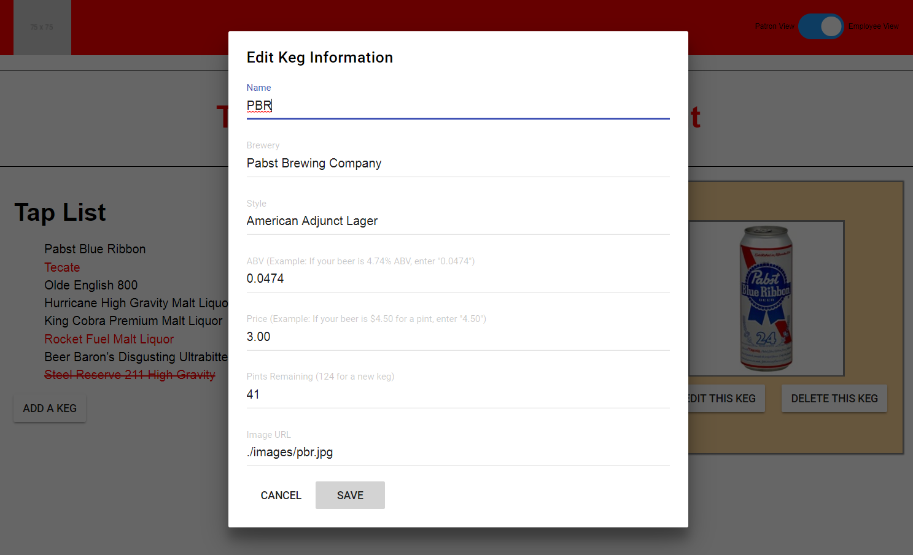

# "The Beer Baron's Beer Basement"

### _Created By_ **Joe Friesen**

## Description

This application is a recreation of a previous project ([https://github.com/josephfriesen/beer-baron](https://github.com/josephfriesen/beer-baron)) built in Angular, now built using React. The application is an inventory manager for a mock tap room; in patron view, patrons can view the list of beers the bar has on tap, and a detail view for a selected beer, and in employee view, an employee can add/edit/delete beers in inventory.

Submitted for Epicodus code review on 11/16/2018.

## Screenshots

Patron view


Employee view


Employee view / Edit modal open


## Development Planning

#### Component Structure

Before starting work on the app, I sketched a graph representing the component structure that would be needed to most closely replicate the functionality of the previous build of the application that would utilize React components rather than Angular components.


#### Notes

* Clearly, the structure as laid out above differs from how it came out in the practice of building a proper React-based application: the keg list above is living in its own file rather than in the app component's state, several components are listed as stateful rather than static while my build just has the app component as stateful, etc. I think this is largely due to the difference in building with Angular components vs. React components. For one, React components being more granular and specified than Angular components, it was easy to dive into development, then see that the best component structure based on the work thus far differs from the original structure, where in Angular I would know I would just need the one component to do all the things the several specified interrelated React components would do.

## Technologies Employed

* React-DOM
* React-Router
* [React Toolbox](https://github.com/react-toolbox/react-toolbox)
* Webpack
* HTML/CSS
* JavaScript

## Installation Instructions

* *Clone this repository:*
  * In terminal, enter the following:
```
$ cd ~/desktop
$ git clone https://github.com/josephfriesen/beer-baron-react.git
$ cd beer-baron-react
```
* *Build:*
  * In terminal, enter
```
$ npm install
$ npm run start
```
* *Open:*
  * In a browser, navigate to *localhost:8080/*

### Legal

Copyright (c) 2018 [Joseph Friesen](mailto:friesen.josephc@gmail.com)
